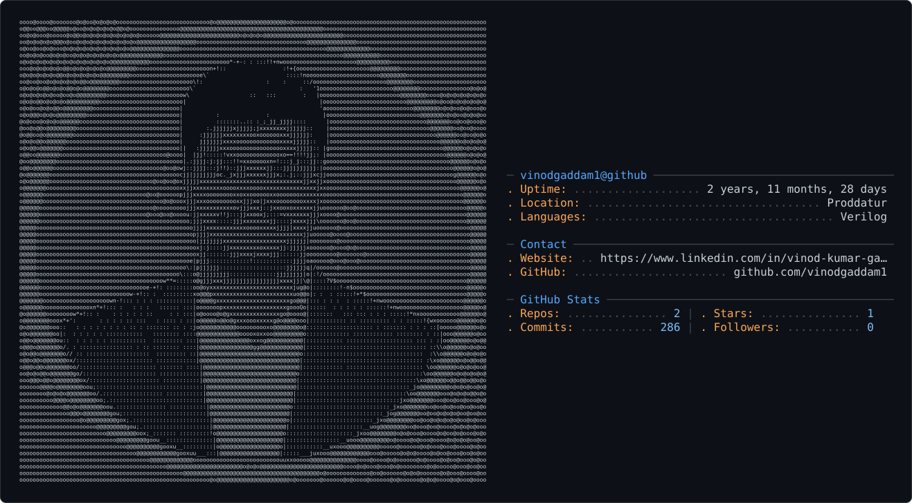

Edit my GitHub profile README.md.

IMPORTANT:
- Preserve my existing content, sections, wording, links, badges, projects, skills, GitHub stats, education, certifications, and footer.
- Do NOT rewrite or remove my existing profile content unless it is duplicated.
- Do NOT change my GitHub username: vinodgaddam1.
- Do NOT change my existing visual theme.

Fix the current README structure.

1. Keep ONLY ONE copy of the main profile header:
   - GADDAM VINOD KUMAR
   - typing animation
   - Verilog / SystemVerilog / Digital Design / ASIC Flow / RISC-V
   - Email, LinkedIn, and GitHub buttons
   - header separator

2. Remove all accidental duplicate copies of the header.

3. Keep ONLY ONE "## 🔷 About Me" section.
   Remove any accidental duplicate "About Me" heading.

4. Add the gh-ascii profile card ONLY ONCE, immediately below the main header and before "## 🔷 About Me".

5. Use exactly this code for the gh-ascii card:

<picture>
  <source media="(prefers-color-scheme: dark)" srcset="dark_mode.svg" />
  <source media="(prefers-color-scheme: light)" srcset="light_mode.svg" />
  
</picture>

6. The repository already contains:
   - dark_mode.svg
   - light_mode.svg

   Therefore use relative paths exactly as:
   dark_mode.svg
   light_mode.svg

7. Do NOT use:
   - https://github.com/vinodgaddam1 as the SVG path
   - a remote URL for dark_mode.svg
   - a remote URL for light_mode.svg

8. The beginning of the final README must have this structure:

   Main Header
       ↓
   gh-ascii picture
       ↓
   ## 🔷 About Me
       ↓
   existing About Me content
       ↓
   all remaining existing sections

9. Remove accidental duplicate 
, 
, header images, typing SVG, and gh-ascii blocks created during previous edits.

10. Keep the rest of the README unchanged.

Return the COMPLETE corrected README.md in one Markdown code block so I can copy and paste it directly into GitHub.
